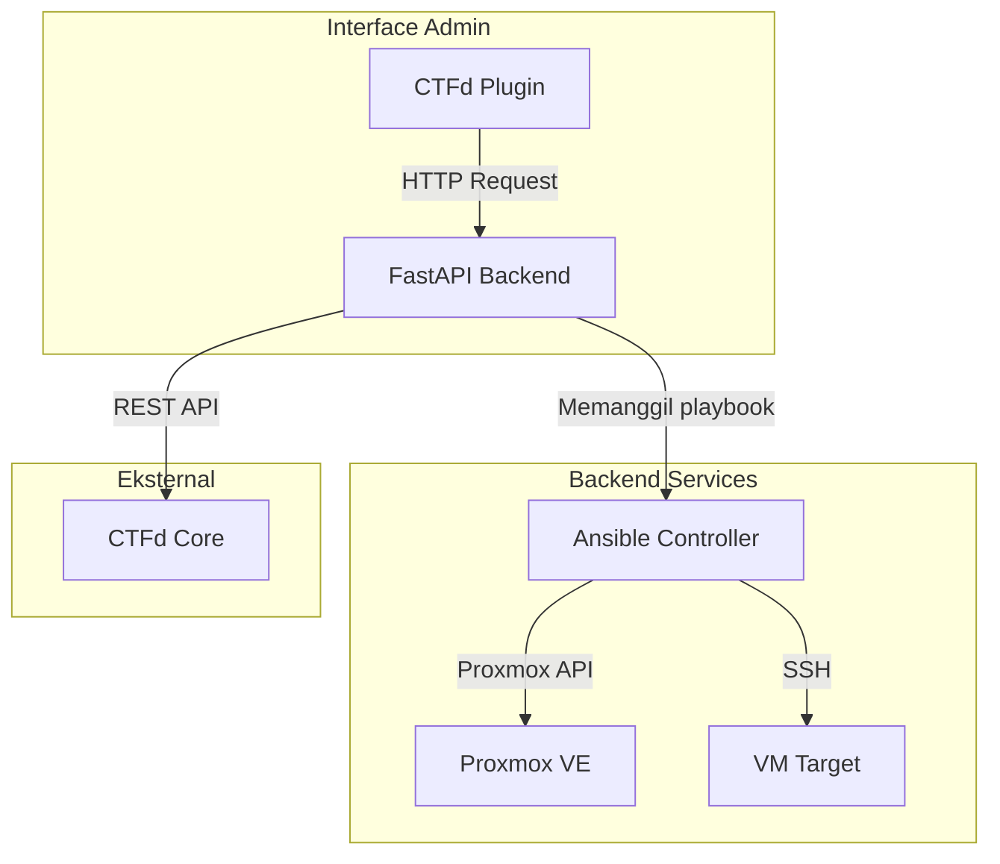

# Konteks Pengembangan Sistem Orkestrasi Challenge CTF

Dokumen ini menjelaskan konteks pengembangan masing-masing komponen dalam arsitektur sistem yang dirancang untuk mengotomatisasi pembuatan dan pengelolaan challenge CTF berbasis VM. Sistem ini terdiri dari beberapa komponen utama yang saling terintegrasi, dengan fokus pada pendekatan Infrastructure as Code (IaC) dan otomatisasi.

## Arsitektur Umum

Berikut adalah gambaran aritektur sistem secara keseluruhan:

## Komponen 1: CTFd Plugin

### Tujuan
Plugin ini berfungsi sebagai antarmuka admin di dalam platform CTFd. Admin dapat membuat, mengelola, dan memantau challenge VM langsung dari dashboard CTFd.

### Tanggung Jawab
- Menyediakan halaman/form untuk membuat challenge baru.
- Mengirim permintaan ke FastAPI Backend untuk membuat VM.
- Menampilkan status dan informasi akses challenge (IP, port).
- (Opsional) Menampilkan log atau metrik dari VM.

### Teknologi
- Bahasa: Python (mengikuti struktur plugin CTFd)
- Framework: Flask (internal CTFd)
- Komunikasi: HTTP request ke FastAPI (menggunakan `requests`)

### Alur Kerja
1. Admin membuka halaman plugin di `/admin/orchestrator`.
2. Admin mengisi formulir (nama challenge, template, dll).
3. Plugin mengirim POST request ke endpoint FastAPI (`/api/deploy`).
4. Plugin menerima respons (sukses/gagal) dan menampilkan notifikasi.
5. Plugin secara periodik dapat meminta status VM ke FastAPI untuk update real-time.

## Komponen 2: FastAPI Backend

### Tujuan
Backend utama yang mengorkestrasi seluruh proses pembuatan challenge. Menyediakan REST API untuk plugin CTFd dan bertanggung jawab memanggil Ansible serta berkomunikasi dengan CTFd core.

### Tanggung Jawab
- Menerima request dari plugin CTFd.
- Menyimpan data challenge ke database lokal (misal: SQLite/PostgreSQL).
- Memanggil playbook Ansible dengan parameter yang sesuai.
- Mengelola status VM (deploying, running, failed, deleting).
- Berkomunikasi dengan API CTFd untuk membuat challenge entry.
- Menyediakan endpoint untuk mendapatkan status dan log VM.

### Teknologi
- Framework: FastAPI (Python)
- Database: SQLite (development) / PostgreSQL (production)
- Ansible Integration: `ansible-runner` atau subprocess
- HTTP Client: `httpx` atau `requests`

### Alur Kerja
1. Endpoint `POST /deploy` menerima data challenge.
2. Validasi data menggunakan Pydantic.
3. Simpan record challenge dengan status `pending` di database.
4. Jalankan playbook Ansible secara asinkron (background task) agar tidak memblokir response.
5. Kembalikan response segera (`202 Accepted`) dengan ID task.
6. Setelah playbook selesai, update status di database.
7. Jika sukses, buat challenge di CTFd via API-nya, simpan mapping ID CTFd dengan VM ID.

## Komponen 3: Ansible Controller

### Tujuan
Melakukan provisioning dan konfigurasi VM secara otomatis menggunakan Ansible. Ansible bertindak sebagai alat orkestrasi yang menghubungkan FastAPI dengan infrastruktur Proxmox dan VM target.

### Tanggung Jawab
- Membuat VM baru di Proxmox melalui API-nya (menggunakan module `community.general.proxmox`).
- Mengkonfigurasi VM dengan cloud-init (IP static, SSH key, dll).
- Memastikan VM siap digunakan (menunggu SSH aktif).
- Menjalankan tugas konfigurasi lebih lanjut di dalam VM (instalasi dependensi, deploy file challenge, setup service).
- Mengembalikan informasi VM (IP, VM ID) ke FastAPI.

### Teknologi
- Ansible Core
- Module: `community.general.proxmox`, `ansible.builtin.shell`, `ansible.builtin.wait_for`
- Inventory: Dinamis atau statis (dibuat per-VM)

### Playbook yang Dibutuhkan
1. `deploy-vm.yml`: Membuat VM di Proxmox, mengatur cloud-init, dan menunggu VM siap.
2. `configure-challenge.yml`: Terhubung ke VM via SSH, menginstal paket, menyalin file challenge, memulai service.

### Alur Kerja
1. FastAPI memanggil `ansible-runner` dengan playbook `deploy-vm.yml` dan extra vars.
2. Ansible menjalankan tugas:
   - Clone template VM di Proxmox.
   - Set konfigurasi network dan SSH keys.
   - Start VM.
   - Tunggu hingga VM merespon SSH.
3. Jika sukses, Ansible mengembalikan IP dan VM ID ke FastAPI (via callback atau file output).
4. FastAPI kemudian memanggil playbook kedua untuk konfigurasi internal VM.

## Komponen 4: Proxmox VE

### Tujuan
Platform virtualisasi tempat VM challenge dijalankan. Proxmox menyediakan API untuk mengelola VM secara terprogram.

### Tanggung Jawab
- Menyediakan template VM dengan cloud-init (misal: Ubuntu 22.04).
- Menerima perintah dari Ansible untuk membuat, mengonfigurasi, dan menghapus VM.
- Menyediakan jaringan yang memungkinkan akses ke VM (misal: bridge, NAT, port forwarding).

### Konfigurasi yang Diperlukan
- Template VM dengan cloud-init support.
- User dengan hak akses API (token API).
- Jaringan yang sesuai (misal: vmbr0 untuk akses langsung, atau konfigurasi port forwarding di host).

### Alur Kerja
1. Ansible mengirim request ke API Proxmox untuk clone template.
2. Proxmox membuat VM baru dengan ID unik.
3. Ansible mengirim update konfigurasi cloud-init (IP, SSH keys).
4. Proxmox menjalankan VM.
5. VM mendapatkan IP sesuai konfigurasi dan siap diakses.

## Komponen 5: Integrasi dan Alur Data

### Ringkasan Alur Lengkap
1. **Admin** → mengisi form di plugin CTFd.
2. **Plugin** → mengirim `POST /deploy` ke FastAPI.
3. **FastAPI** → simpan status, jalankan background task:
   - Panggil Ansible playbook `deploy-vm.yml`.
   - Ansible buat VM via Proxmox.
   - Ansible tunggu VM siap, kembalikan IP dan VM ID.
   - FastAPI simpan IP, VM ID.
   - Panggil Ansible playbook `configure-challenge.yml` untuk setup di dalam VM.
   - Setelah selesai, buat challenge di CTFd via API-nya.
   - Update status di database menjadi `running`.
4. **FastAPI** → kembalikan respons awal ke plugin (202 Accepted).
5. **Plugin** → dapat menampilkan status dengan polling ke endpoint `/status/{task_id}`.

### Database FastAPI (Contoh Skema)
| Field | Type | Keterangan |
|-------|------|------------|
| id | int | Primary key |
| task_id | str | UUID untuk tracking |
| challenge_name | str | Nama challenge |
| vm_id | int | ID VM di Proxmox |
| ip_address | str | IP VM |
| ctfd_challenge_id | int | ID challenge di CTFd |
| status | enum | pending, running, failed, deleting |
| created_at | datetime | |
| updated_at | datetime | |

## Catatan Pengembangan dan Prioritas

### Tahap 1: Foundation
- [ ] Setup FastAPI dengan endpoint sederhana (hello world).
- [ ] Integrasi dengan `ansible-runner` secara lokal (panggil playbook contoh).
- [ ] Buat database dan model sederhana.

### Tahap 2: Integrasi Proxmox
- [ ] Buat playbook Ansible untuk clone template VM di Proxmox.
- [ ] Uji coba pembuatan VM manual via Ansible.
- [ ] Tambahkan konfigurasi cloud-init (IP static, SSH key).
- [ ] Pastikan VM bisa diakses SSH.

### Tahap 3: Backend API Lengkap
- [ ] Buat endpoint `POST /deploy` dengan background task.
- [ ] Simpan data ke database.
- [ ] Buat endpoint `GET /status/{task_id}`.
- [ ] Integrasi dengan CTFd API (buat challenge setelah VM siap).

### Tahap 4: Plugin CTFd
- [ ] Buat plugin sederhana yang menampilkan form.
- [ ] Plugin mengirim request ke FastAPI.
- [ ] Plugin menampilkan status dan informasi akses.

### Tahap 5: Monitoring dan Logging
- [ ] Tambahkan logging di FastAPI.
- [ ] (Opsional) Integrasi dengan Prometheus untuk metrik.

### Tahap 6: Pengujian dan Dokumentasi
- [ ] Uji alur lengkap.
- [ ] Dokumentasikan API dengan Swagger (otomatis dari FastAPI).
- [ ] Buat dokumentasi penggunaan untuk admin.

## Kesimpulan

Dengan pembagian komponen yang jelas dan alur kerja yang terdefinisi, proyek ini dapat dikembangkan secara bertahap. Fokus pada otomatisasi infrastruktur (EIM) akan menjadi nilai tambah utama, dan integrasi dengan CTFd memastikan hasilnya dapat langsung digunakan. Selamat mengembangkan!